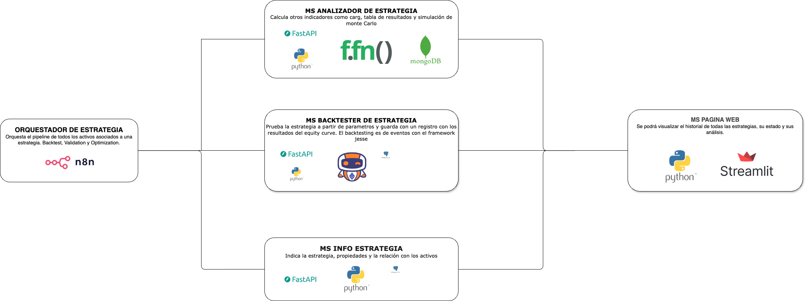

# Proyecto de Qant-Trading - doctrade 👌

## Descripción General

Este proyecto es una fábrica donde un puede hacer multiples backtestings y analisis de una estrategia creada en Jesse Trade. La idea es que despues de creada la estrategia en jesse, exista un proceso para que haga backtesting y el analisis de esta estrategia en diferentes activos sin tener hacerlo manualmente.

## Componentes de la solucion

